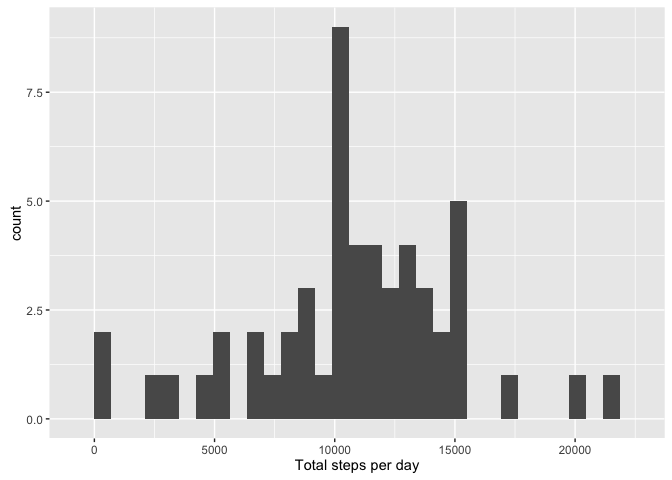
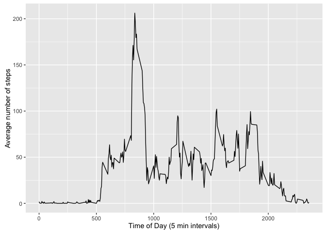
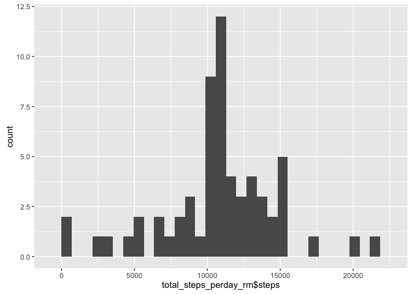
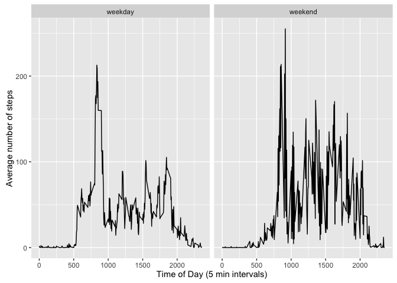

# Reproducible Research: Peer Assessment 1

## 1. Loading and preprocessing the data

We first read and unzip the datafile and store it into the activity_data variable.
We also convert the date column from character to date class.


```r
activity_data <- read.csv(unz("activity.zip", "activity.csv"))
activity_data$date <- as.Date(activity_data$date)
```

## 2. What is mean total number of steps taken per day?

We start this question by calculating the total number of steps taken per day for each of the days and storing it into the total_steps_perday variable. Note that the aggregate function ignores missing values by default.


```r
total_steps_perday <- aggregate(steps~date, data=activity_data, sum)
```

We then display the data in a histogram. The point here is that the histogram displays the frequency of individual step totals (a continuous variable, but here in 30 bins) and NOT an x-y plot of step totals per each of the days.


```r
require(ggplot2)
```

```
## Loading required package: ggplot2
```

```r
qplot(total_steps_perday$steps)+geom_histogram()+xlab("Total steps per day")
```

```
## `stat_bin()` using `bins = 30`. Pick better value with `binwidth`.
```

```
## `stat_bin()` using `bins = 30`. Pick better value with `binwidth`.
```



The mean and median of total number of steps are 

```r
mean(total_steps_perday$steps)
```

```
## [1] 10766.19
```

```r
median(total_steps_perday$steps)
```

```
## [1] 10765
```

## 3. What is the average daily activity pattern?

We start this question off by calculating the mean of steps in each of the 5 minute intervals and store it into the activity_pattern variable.


```r
activity_pattern <- aggregate(steps~interval, data=activity_data, mean)
```

We then display this data using ggplot's geom_line, which graphically displays the average daily activity pattern. 


```r
ggplot(activity_pattern)+geom_line(aes(x=interval, y=steps))+xlab("Time of Day (5 min intervals)")+ylab("Average number of steps")
```



## 4. Imputing missing values

The number of incomplete cases in our data set is 

```r
sum(!complete.cases(activity_data))
```

```
## [1] 2304
```

We then move on to multiple inputting. The method I chose is to fill the missing values with the mean of steps in the particular 5 minute interval.


```r
activity_data$steps[is.na(activity_data$steps)] <- with(activity_data, ave(steps, interval, FUN = function(x){round(mean(x, na.rm=T, trim=0))}))[is.na(activity_data$steps)]
```

We then recalculate the total steps for each of the days and store that in the total_steps_perday_rm variable. Again, we use the aggregate function.


```r
total_steps_perday_rm <- aggregate(steps~date, data=activity_data, sum)
```

Then we replot the plot from question 2, but using this new data.


```r
qplot(total_steps_perday_rm$steps)+geom_histogram()
```

```
## `stat_bin()` using `bins = 30`. Pick better value with `binwidth`.
## `stat_bin()` using `bins = 30`. Pick better value with `binwidth`.
```



We also recalculate the mean and median, which are now

```r
mean(total_steps_perday_rm$steps) 
```

```
## [1] 10765.64
```

```r
median(total_steps_perday_rm$steps)
```

```
## [1] 10762
```

## 5. Are there differences in activity patterns between weekdays and weekends?

We start the last question off by creating a new column in our dataset called weekday, which is a factor variable with 2 levels: the date can either we a weekday or a weekend.


```r
activity_data$weekday[weekdays(as.Date(activity_data$date))!=c("Sunday","Saturday")] <- "weekday"
activity_data$weekday[weekdays(as.Date(activity_data$date))==c("Sunday","Saturday")] <- "weekend"
activity_data$weekday <- as.factor(activity_data$weekday)
```

We then calculate the mean of the number of steps for each of the 5 minute intervals, but this time divided by whether the day is a weekday or part of a weekend. We also plot this result in a panel plot.


```r
activity_pattern_weekday <- aggregate(steps~interval + weekday, data=activity_data, mean)

ggplot(activity_pattern_weekday)+geom_line(aes(x=interval, y=steps))+xlab("Time of Day (5 min intervals)")+ylab("Average number of steps")+facet_grid(.~weekday)
```


